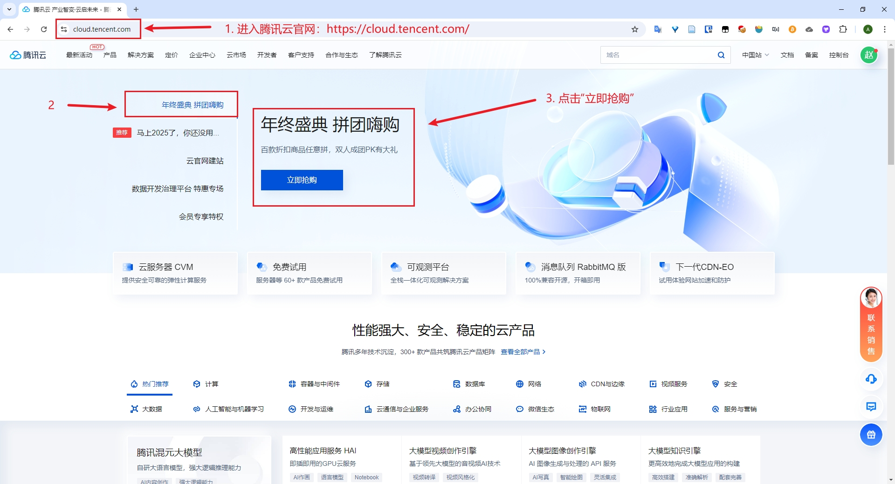
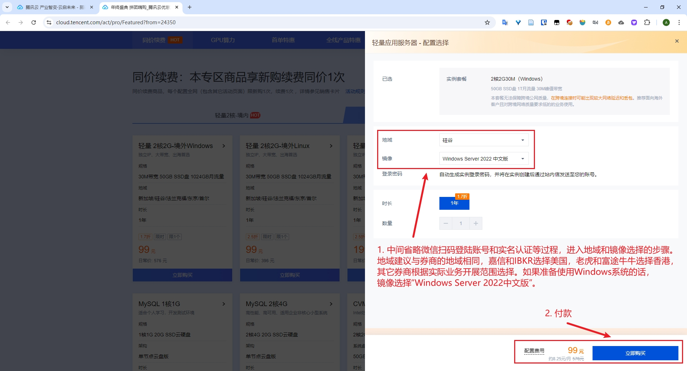
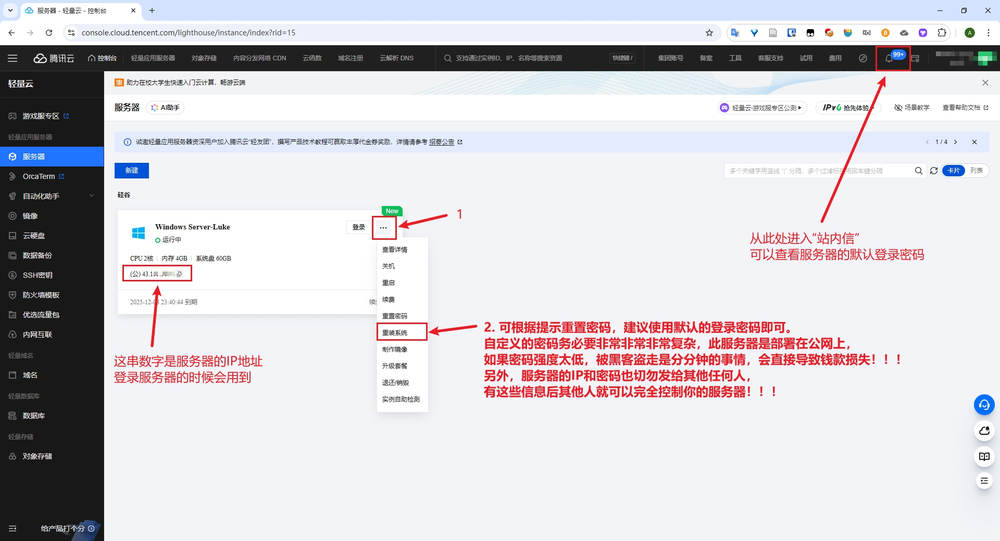
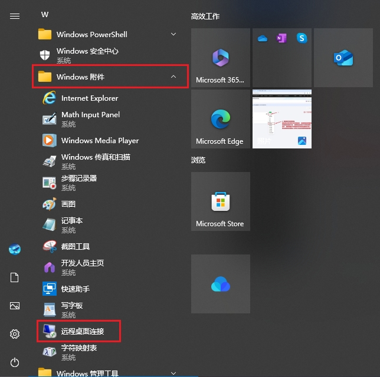
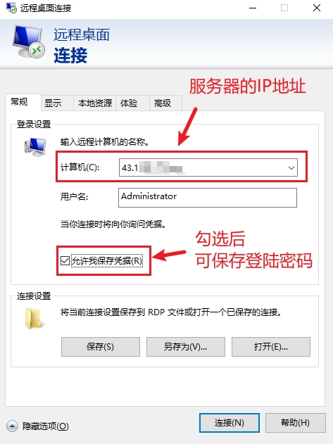
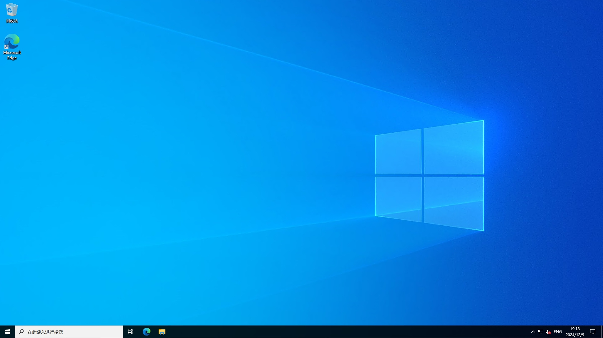
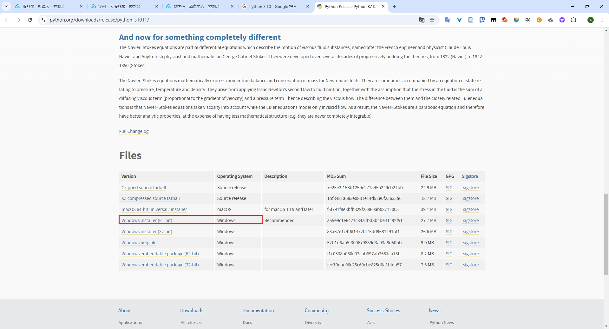
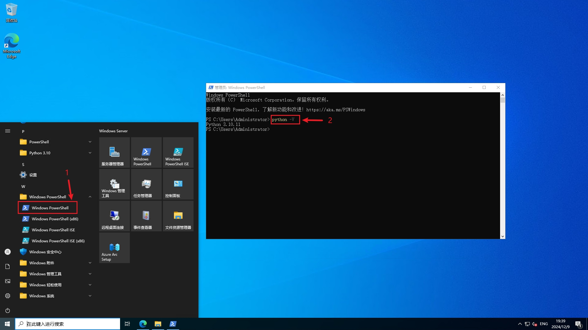
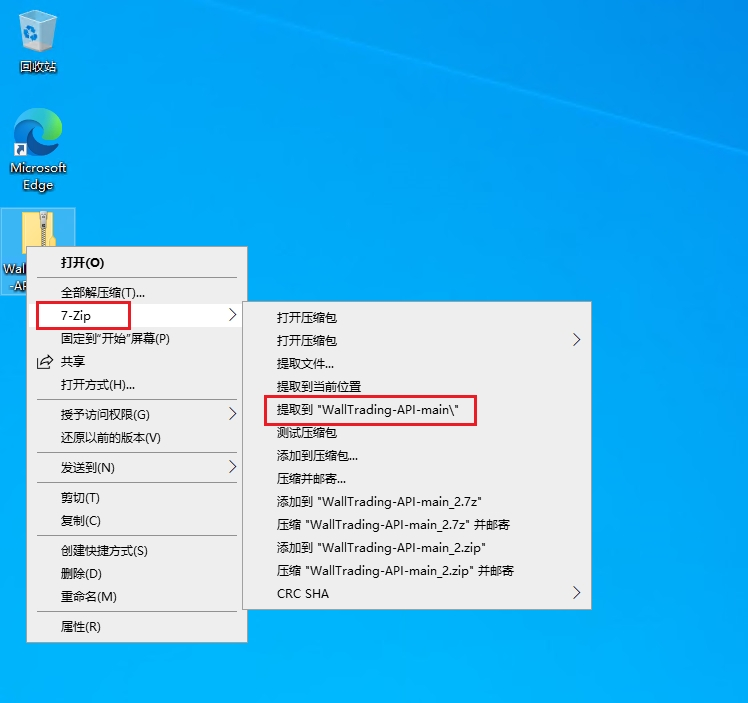

# 腾讯云境外 Windows 服务器开通教程

进入腾讯云官网（https://cloud.tencent.com/）根据教程完成服务器购买。

服务器地域选择时需要注意下，**建议根据券商地域来确定服务器地域**，比如嘉信、IBKR 和美版富途 MooMoo 选择硅谷，老虎和富途牛牛选择香港，这样的话可以尽可能地降低实际使用中网络波动带来的各种连接性问题。

之后点击网页右上角头像旁边的“控制台”（没有找到的话参考第一张图片的右上角）进入后台管理界面，之后如图进入“轻量应用服务器”管理界面。

用于服务器登录的默认密码在右上角头像左侧的“站内信”中可以查看，也可以按照下图步骤重置登录密码，但**密码务必要非常非常非常复杂**，给暴露在公网中的服务器设置简单的密码是一件非常非常非常危险的事情，**简单的密码几乎 100% 会导致服务器被盗，进而导致财产损失**！！！建议如果没有必要的话，使用默认密码即可，一般是随机的字符串（例如：`8m5Wju.0k#OM3`），比自己设置的更加安全。

现在有了服务器的 IP 地址和密码，再加上默认的用户名`Administrator`，我们就可以登录服务器啦。在 Windows 10 系统中，可以使用“远程桌面连接”来登录服务器。

输入服务器的 IP 和 用户名 `Administrator`，点击“连接”后再输入服务器密码，即可成功登录服务器。

登录成功，看起来其实就是 Windows 10 的界面啦，所以不需要对“服务器”有什么心理负担——**它只是一台你可以远程控制的 Windows 电脑而已**~

如果在操作上觉得稍微有点卡顿，这一般不是配置不足带来的卡顿，而是由于你和服务器之间的网络延迟造成的，一般中美之间最少也有 200ms 左右的延迟，这个延迟只会在远程控制服务器的时候让你感觉有些卡顿，但**不会影响 WallTrading-API 的运行**，不必担心。

请注意，从这里开始，以下的操作均在服务器上完成，操作的时候注意区分本地电脑和远程服务器。

浏览器打开Python 官网（https://www.python.org/downloads/release/python-31011/），下载 Python 3.10.11 版本。

安装 Python。

安装完成后，打开 PowerShell，输入命令`python -V`，如果能如下图一样正确显示 Python 的版本，则安装成功。

接着在浏览器中打开 WallTrading-API 的项目地址（https://github.com/LukeWang01/WallTrading-API），下载项目并解压缩。

此时，就完成前期的服务器准备工作啦。

